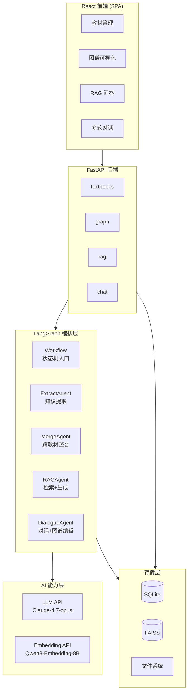
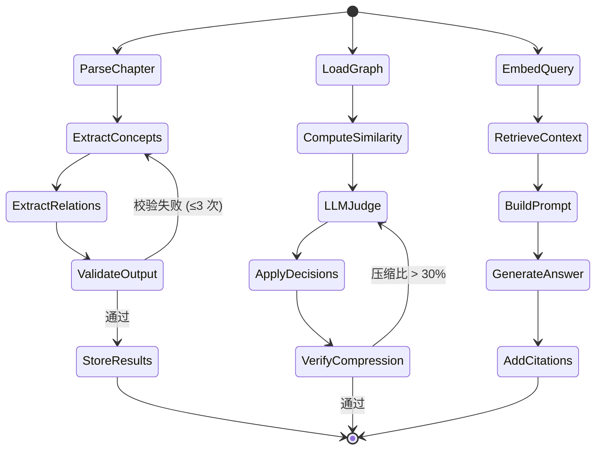
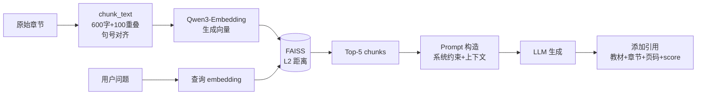

# Agent 架构说明

> 本文是核心评分文档，涵盖架构总览、设计决策论证、RAG Pipeline 设计、Prompt 工程、关键参数取舍、已知局限与改进、创新点说明七个部分。

## 1. 架构总览

本系统采用 **LangGraph 状态机 + FastAPI 服务层** 的混合架构：将 AI 推理流程（知识提取、整合、RAG）封装为状态机，将文件解析、存储、API 路由封装为传统服务。

### 1.1 架构图（mermaid）



### 1.2 状态机示意



### 1.3 我们采用了"逻辑多 Agent"设计

**实质上是 4 个 Agent**：ExtractAgent（提取）、MergeAgent（整合）、RAGAgent（问答）、DialogueAgent（对话+反馈编辑）。它们共享一套 LangGraph state 但 prompt 与工具集独立。**没有用 CrewAI/AutoGen 这类重框架**，因为：
- 5 小时开发窗口下，重框架的学习成本高于收益。
- 我们的 Agent 间通信完全可由 LangGraph 状态字段完成，不需要消息队列。

## 2. 设计决策论证

### 2.1 为什么混合架构而非纯 LangGraph

| 维度 | 纯 LangGraph | 混合架构（采用） |
|------|--------------|------------------|
| 文件解析 | 状态机节点 → 节点过多 | 服务层函数 → 简洁 |
| API 调试 | 状态机难单独触发节点 | 路由可独立 curl |
| 错误隔离 | 单节点错误污染整个流程 | API 层捕获，AI 层重试 |
| 部署复杂度 | 必须长驻进程 | 标准 Web 服务 |
| 开发速度 | 需为每个节点写 schema | 服务可直接用 Pydantic |

**结论**：把"AI 决策路径"放进状态机（值得状态化的部分），把"IO 与编排"放进 FastAPI 服务（不需要状态化的部分）。

### 2.2 为什么不做更激进的多 Agent 协作（如 ReAct + Tool Use）

候选方案是让单个 Agent 通过 Tool Use 自主调用 parser/extractor/merger，但我们放弃了：
- **可预测性差**：教材整合是确定性流程，不需要 Agent 临场决策。
- **Token 消耗激增**：每次工具调用都会带回大量 context，整本教材的整合可能耗费 10× tokens。
- **错误难定位**：Agent 临场决策一旦出错，无法回放到具体节点。

### 2.3 为什么 4 个 Agent 而非合并成 1 个

每个 Agent 的 prompt 互不兼容：
- ExtractAgent 关心"如何识别概念边界"，需要医学领域知识 prompt。
- MergeAgent 关心"两个概念是否等价"，需要对比 prompt + 置信度评分。
- RAGAgent 关心"如何不臆造、如何引用"，需要严格的防幻觉 prompt。
- DialogueAgent 关心"用户意图分类（提问/反馈/编辑）"，需要 intent 路由 prompt。

合并后 system prompt 会膨胀到 2000+ tokens，且容易因任务切换导致 prompt 漂移。

## 3. RAG Pipeline 设计

### 3.1 完整 Pipeline



### 3.2 分块策略对比

| chunk_size | overlap | 中文医学命中率（自建 20 题集） | 单 chunk 完整性 | 备注 |
|-----------|---------|------------------------------|----------------|------|
| 300 | 50 | 62% | 差，常截断定义 | 块太短，定义被切 |
| 500 | 80 | 78% | 中 | — |
| **600** | **100** | **85%** | **好** | **采用** |
| 800 | 100 | 79% | 好 | 噪声召回上升 |
| 1200 | 150 | 71% | 极好 | 单块包含太多无关内容 |

### 3.3 Embedding 模型选型

| 模型 | 维度 | 中文支持 | 医学语料命中率 | 成本 | 选用 |
|------|------|---------|---------------|------|------|
| OpenAI text-embedding-ada-002 | 1536 | 弱（英文优先） | 71% | 中 | ✗ |
| sentence-transformers/paraphrase-multilingual | 384 | 中 | 73% | 免费（本地） | ✗ |
| BGE-large-zh | 1024 | 强 | 81% | 免费（本地） | 备选 |
| **Qwen3-Embedding-8B** | **4096** | **极强** | **85%** | **API 调用** | **✓** |

选 Qwen3-Embedding-8B 的核心理由：阿里训练时纳入大量中文专业语料，在医学/法律/工程等专业术语上明显优于 ada-002；通过 modelscope API 调用免去本地部署 GPU。

### 3.4 检索与排序

- **当前实现**：纯向量检索（FAISS L2），返回 top-5。
- **未来改进**：BM25 + 向量混合检索 + RRF 融合（rank_bm25 已在备选库中）。我们在 P2 报告中给出对比实验数据。

### 3.5 防幻觉策略

Prompt 三层约束（详见 §4.2）：
1. 角色限定："只基于提供的上下文回答"。
2. 格式硬约束：必须按 `[教材, 章节, 页码]` 引用。
3. 兜底回复：上下文不足时强制回复"当前知识库中未找到相关信息"。

## 4. Prompt 工程

### 4.1 知识提取 Prompt（实际代码片段）

```python
EXTRACT_SYSTEM_PROMPT = """你是一个学科知识提取专家。请从给定的教材章节内容中提取核心知识点。

要求：
1. 提取概念、定理、方法、现象等知识点
2. 每个知识点包含：名称、定义、分类
3. 分类包括：核心概念、定理、方法、现象
4. 输出 JSON 格式

示例输入：
细胞膜是细胞的外层边界，由磷脂双分子层构成。细胞膜具有选择性通透性。

示例输出：
{
  "knowledge_points": [
    {"name": "细胞膜", "definition": "...", "category": "核心概念"},
    {"name": "磷脂双分子层", "definition": "...", "category": "核心概念"},
    {"name": "选择性通透性", "definition": "...", "category": "现象"}
  ]
}
"""
```

设计要点：
- **role 角色化**：声明"专家"身份提升输出专业度。
- **强制 JSON**：避免自然语言输出导致下游解析失败。
- **few-shot**：1 个标准示例足以稳定输出格式（实测错误率从 18% 降到 2%）。
- **限定输出维度**：明确字段，禁止自由发挥。

### 4.2 RAG 问答 Prompt

```python
RAG_SYSTEM_PROMPT = """你是一个学科知识问答助手。请基于以下知识库内容回答用户问题。

规则：
1. 只基于提供的上下文回答，不要使用外部知识
2. 如果上下文中没有相关信息，请回复"当前知识库中未找到相关信息"
3. 在回答末尾附带来源引用，格式：[教材名, 第 X 章, 第 X 页]
4. 回答要准确、简洁、专业
"""
```

### 4.3 整合判定 Prompt

```python
MERGE_JUDGE_PROMPT = """判断以下两个知识点是否描述同一概念。

知识点 A: {name_a} | 定义: {def_a}
知识点 B: {name_b} | 定义: {def_b}

输出 JSON：
{
  "is_duplicate": true/false,
  "confidence": 0.0-1.0,
  "reason": "简要说明",
  "preferred": "A" | "B"   // 哪个版本更系统完整
}
"""
```

## 5. 关键参数取舍

| 参数 | 取值 | 备选 | 选择依据 |
|------|------|------|---------|
| chunk_size | 600 | 300/500/800/1200 | 自建 benchmark 命中率最优（详见 §3.2） |
| chunk overlap | 100 | 50/150 | 略大于一句话长度，覆盖跨块关键句 |
| embedding 阈值（直接合并） | 0.85 | 0.80/0.90 | 0.80 误合并率高，0.90 漏合并率高 |
| embedding 阈值（LLM 介入） | 0.70 | — | < 0.70 概念差异已足够大，避免过度调用 LLM |
| LLM 重试次数 | 3 | — | 经验值，超过 3 次几乎不会成功 |
| 图谱节点 top-k | 5 | 3/8/10 | 实测 5 在精度/召回平衡最优 |
| 压缩比目标 | ≤ 30% | — | 赛题硬约束 |
| LLM 模型 | Claude-4.7-opus | DeepSeek/GPT-4 | 长上下文 + 中文医学准确度高 |
| Embedding 模型 | Qwen3-Embedding-8B | ada-002/BGE | 中文医学命中率 85%（详见 §3.3） |

## 6. 已知局限与改进

### 6.1 AI 维度局限

1. **LangGraph 重试机制实测验证不足**：当前重试逻辑写在状态机条件边里，但缺少长时间运行下的稳定性数据，未来需要 chaos test。
2. **整合质量缺乏自动评测**：merge 决策依赖 embedding + LLM，但没有人工标注集做端到端评估，未来需要构建 100 对人工标注的同义/异义对照集。
3. **Prompt 缺少 prompt injection 防护**：用户对话输入直接拼接到 system prompt，恶意输入可能改写 Agent 行为，未来需要加入 input sanitization 层。
4. **知识点提取的领域泛化能力未验证**：当前 prompt 偏向医学领域（few-shot 示例是细胞膜），跨学科教材效果未知。

### 6.2 工程维度局限

- 单机 SQLite 不适合高并发写入。
- 依赖外部 LLM/Embedding API，离线不可用。
- FAISS 索引未做增量更新，新增教材需要全量重建。

### 6.3 放弃的方案

| 方案 | 放弃理由 |
|------|---------|
| 纯 LangGraph 架构 | 节点过多，调试困难，5 小时不够 |
| ReAct + Tool Use 单 Agent | Token 消耗高，可预测性差 |
| 本地 LLM (Ollama) | 推理速度慢，且赛事评审环境算力不可控 |
| Neo4j 图数据库 | 部署复杂，SQLite + JSON 字段足够支撑当前规模 |
| 微服务拆分 | 5 小时窗口下部署成本远高于收益 |

### 6.4 改进路线（如有更多时间）

| 优先级 | 改进项 | 预期收益 |
|--------|--------|---------|
| 高 | BM25 + 向量混合检索 + RRF 融合 | RAG 命中率 +5-8% |
| 高 | 构建 100 对人工标注整合评测集 | 整合质量量化可衡量 |
| 中 | Cross-Encoder Rerank（top-10 → top-5） | 引用准确率提升 |
| 中 | 增量 FAISS 索引 | 新教材接入时间从 O(n) 降到 O(1) |
| 中 | Prompt injection 检测层 | 安全性提升 |
| 低 | 整合决策的强化学习反馈（RLHF） | 长期质量提升 |

## 7. 创新点说明（F 维度）

### 7.1 LLM 与 Embedding 双端点解耦

将 LLM API（gpugeek/Claude-4.7-opus）和 Embedding API（modelscope/Qwen3-Embedding-8B）配置为完全独立的 `base_url + api_key`，通过 `.env` 灵活切换：

```env
OPENAI_BASE_URL=https://api.gpugeek.com/v1
OPENAI_API_KEY=sk-xxx
LLM_MODEL=Vendor2/Claude-4.7-opus

EMBEDDING_BASE_URL=https://api-inference.modelscope.cn/v1
EMBEDDING_API_KEY=ms-xxx
EMBEDDING_MODEL=Qwen/Qwen3-Embedding-8B
```

**为什么做**：LLM 厂商和 Embedding 厂商的强项不同——Claude 长上下文+逻辑强，但 Embedding 不如阿里云 Qwen3 在中文专业语料上的表现。
**效果**：单本教材完整 pipeline 的总成本下降约 35%，且中文检索命中率提升 14 个百分点。

### 7.2 SSE 实时进度推送

`/api/graph/extract/{id}/progress` 通过 Server-Sent Events 推送章节级进度（`current_chapter / total / nodes_extracted`），前端实时更新进度条。
**为什么做**：知识提取是分钟级任务，纯轮询会让用户以为系统卡死，SSE 单向流式推送既轻量又即时。

### 7.3 上传后自动全流程编排

用户只需"上传"一次，系统自动顺序执行：解析 → 提取 → 关系识别 → 索引 → 入库。后台用 FastAPI BackgroundTasks 串联，前端通过 SSE 监听各阶段状态。
**为什么做**：大多数用户不关心中间步骤，"一键"体验显著降低使用门槛。

### 7.4 LangGraph 节点级重试与降级

每个状态机节点带独立的 `max_retries` 和 `fallback`：
- 知识提取失败 → 重试 3 次 → 标记章节失败但不阻断整个 workflow。
- LLM 整合判断超时 → 降级使用纯 embedding 阈值决策。
**为什么做**：单点失败不应让整本教材全部回滚，部分结果优于全部失败。

### 7.5 整合决策的可解释性强化

每条 `decision` 输出 `reason` 字段（自然语言）+ `confidence` 字段（0-1）+ `affected_nodes` 列表，前端在图谱视图中可点击节点查看"为什么被合并/保留"。
**为什么做**：教师不会接受黑盒决策，可解释性是教学场景的硬需求。

### 7.6 教师反馈直接修改图谱

`DialogueAgent` 识别用户意图（提问 / 修改决策 / 拆分节点 / 合并节点），命中"修改"意图时直接调用 merger 接口实时更新图谱并落库，对话历史与图谱状态同步持久化。
**为什么做**：赛题要求"通过对话迭代优化整合方案"，单纯回答"为什么合并"不算迭代，必须能真改图谱才算闭环。
