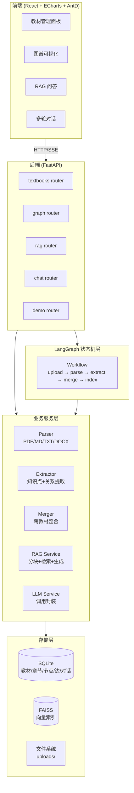
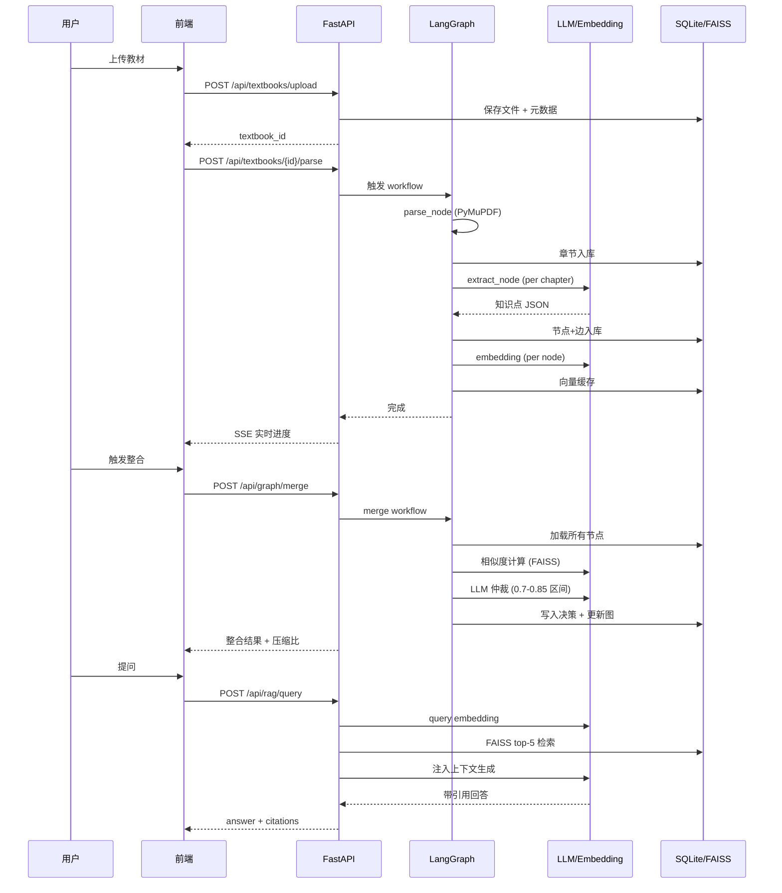
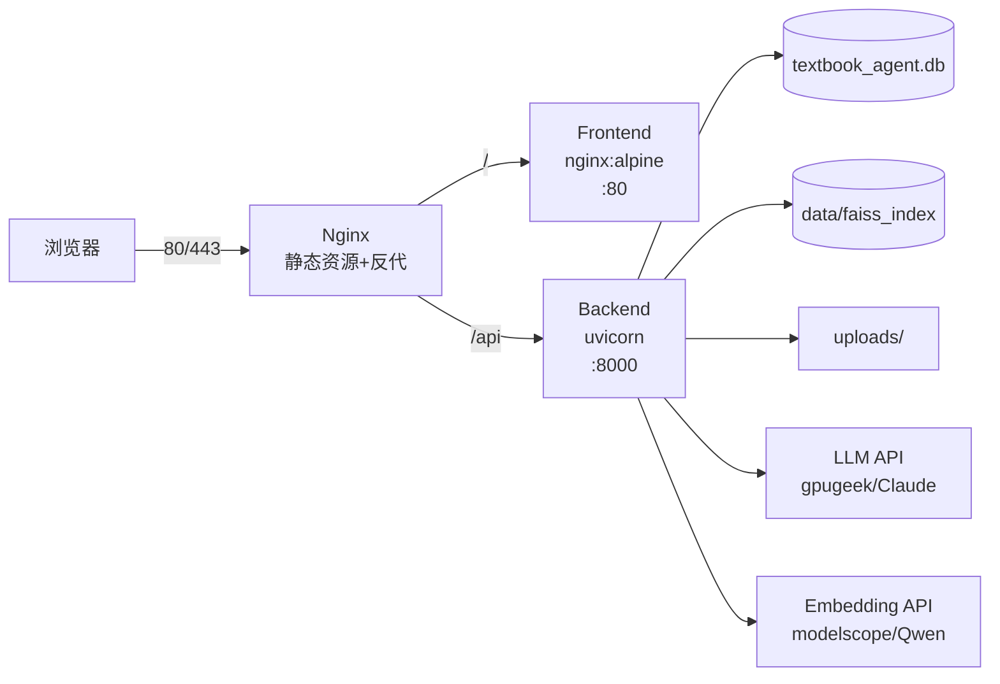

# 系统设计

## 1. 系统架构

### 1.1 总体架构图



### 1.2 分层职责

| 层 | 职责 | 关键模块 |
|---|---|---|
| 前端 SPA | 用户交互、可视化、对话 | React 18 + ECharts 5 + Ant Design |
| API 层 | 路由、参数校验、SSE 流式响应 | FastAPI routers (5 个) |
| 服务层 | 解析/提取/整合/检索/LLM 调用 | services/* (5 个核心服务) |
| 编排层 | 端到端流程编排、状态持久化 | LangGraph workflow + nodes + state |
| 存储层 | 关系数据 + 向量数据 + 文件 | SQLite + FAISS + 本地文件系统 |

## 2. 数据流

### 2.1 端到端数据流（mermaid sequence）



## 3. 技术选型

| 组件 | 选型 | 理由 |
|------|------|------|
| 后端框架 | FastAPI | async 原生支持，自动 OpenAPI，生态成熟 |
| 前端框架 | React 18 | 组件化、生态丰富，适配 ECharts/AntD |
| 可视化 | ECharts 5 | 力导向图开箱即用，中文文档完善 |
| AI 编排 | LangGraph | 状态机模型清晰，重试/分支天然支持 |
| 向量库 | FAISS | 单机轻量，无需额外服务，适合 5 小时部署 |
| 数据库 | SQLite (aiosqlite) | 零配置，足够支撑评审场景的并发 |
| LLM 网关 | OpenAI 兼容协议 | LLM 与 Embedding 双端点解耦，可灵活混搭厂商 |
| Embedding | Qwen3-Embedding-8B | 中文优势明显，medical 词汇覆盖好 |
| 文件解析 | PyMuPDF + python-docx | PDF 性能强，DOCX 章节结构识别准 |
| 部署 | Docker Compose | 一键启动前后端 + nginx |

## 4. API 接口规范（节选请求/响应示例）

完整列表见 `docs/接口文档.md`。下面为关键接口的请求/响应示例。

### 4.1 上传教材

**请求**
```http
POST /api/textbooks/upload
Content-Type: multipart/form-data

file: 生理学.pdf
```

**响应**
```json
{
  "textbook_id": "tb_abc123",
  "filename": "生理学.pdf",
  "format": "pdf",
  "size": 8523174,
  "status": "uploaded"
}
```

### 4.2 提取知识图谱

**请求**
```http
POST /api/graph/extract/tb_abc123
```

**响应**（异步任务，进度通过 SSE 推送）
```json
{
  "task_id": "task_xyz",
  "stream_url": "/api/graph/extract/tb_abc123/progress"
}
```

**SSE 进度事件**
```
event: progress
data: {"current_chapter": 3, "total": 12, "nodes_extracted": 18}

event: done
data: {"total_nodes": 72, "total_edges": 58}
```

### 4.3 跨教材整合

**请求**
```http
POST /api/graph/merge
Content-Type: application/json

{
  "textbook_ids": ["tb_abc123", "tb_def456", "tb_ghi789"],
  "similarity_threshold": 0.85
}
```

**响应**
```json
{
  "decisions": [
    {
      "decision_id": "merge_001",
      "action": "merge",
      "affected_nodes": ["tb_abc123_n15", "tb_def456_n32", "tb_ghi789_n08"],
      "result_node": "merged_001",
      "reason": "三本教材均覆盖炎症概念，保留病理学版本",
      "confidence": 0.92
    }
  ],
  "stats": {
    "original_nodes": 192,
    "merged_nodes": 138,
    "compression_ratio": 0.274,
    "merge_count": 38,
    "keep_count": 12,
    "remove_count": 4
  }
}
```

### 4.4 RAG 问答

**请求**
```http
POST /api/rag/query
Content-Type: application/json

{
  "question": "什么是炎症？",
  "top_k": 5
}
```

**响应**
```json
{
  "answer": "炎症是机体对致炎因子损伤所发生的防御性反应，主要表现为红、肿、热、痛、功能障碍...",
  "citations": [
    {
      "textbook": "病理学",
      "chapter": "第四章 炎症",
      "page": 78,
      "relevance_score": 0.92
    }
  ],
  "source_chunks": [
    "炎症(inflammation)是具有血管系统的活体组织对各种损伤因子的刺激..."
  ]
}
```

### 4.5 对话与反馈修改图谱

**请求**
```http
POST /api/chat/message
Content-Type: application/json

{
  "session_id": "sess_001",
  "message": "把'抗原'和'免疫原'分开，它们不是同一个概念"
}
```

**响应**
```json
{
  "reply": "已将'抗原'和'免疫原'拆分为独立节点，图谱已更新。",
  "graph_updated": true,
  "modified_nodes": ["merged_018"]
}
```

## 5. 部署架构



启动：`docker-compose up -d` → 浏览器访问 `http://localhost:3000`。
